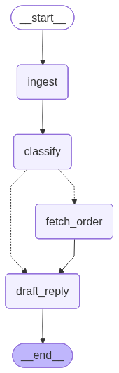

# AI Ticket Triage System

A high-performance, local AI agent designed to triage customer support tickets, validate order details, and draft policy-compliant responses. Built with **LangGraph**, **FastAPI**, and **Ollama**.

## Demo & Visuals

* **Loom Video Demo:** 
    - [Case1: order_id is missing](https://www.loom.com/share/3eb3237b11d74edea17d32a131a2406e)
    - [Case2: LangSmith tracing](https://www.loom.com/share/04fe71639c2f42a8b17d2ecf7e917197)

* **Architecture:**
    <br>
    

## Key Features

* ** Contextual Memory:**
    * The system acts statefully. If a user says "I want a refund" (Turn 1) and then asks "When will I get it?" (Turn 2), the agent remembers the specific Order ID and context without needing it repeated.
    * Uses **"Sticky Threads"**: Automatically binds conversation history to the Order ID for robust state persistence.
* ** Full Observability:**
    * Integrated with **LangSmith** for deep tracing of agent reasoning and tool usage.

## Tech Stack

* **Framework:** LangChain / LangGraph
* **Model:** Qwen3:4b via Ollama
* **API:** FastAPI (Async)
* **Runtime:** Python 3.12+ (Managed via `uv`)

## Setup & Installation

1.  **Prerequisite: Install Ollama**
    Ensure [Ollama](https://ollama.com/) is installed and running. Pull the optimized model:
    ```bash
    ollama pull qwen3:4b
    ```

2.  **Install Dependencies**
    Using `uv` (recommended) or pip:
    ```bash
    uv sync
    # OR
    pip install -r requirements.txt
    ```

3.  **Environment Variables (Optional for Tracing)**
    Create a `.env` file or export these variables to see traces in LangSmith:
    ```bash
    export LANGCHAIN_TRACING_V2=true
    export LANGCHAIN_API_KEY="your-api-key"
    ```

##  Usage

### Option 1. Start the FastAPI
Run the FastAPI backend. This exposes the assessment endpoint (`/triage/invoke`) and the streaming endpoint (`/agent`).

```bash
uv run uvicorn app.server:app --host 0.0.0.0 --port 8000 --reload
```

### Option 2. Run the Interactive Chat UI (Optional)
For a visual chat experience, run the Next.js frontend in a separate terminal.

Navigate to the UI folder:

```Bash
cd agent-chat-ui  # or 'frontend', depending on your folder name
```

Configure the Connection: Ensure a ```.env.local``` file exists in this folder with the following line:

```Bash
NEXT_PUBLIC_API_URL=http://localhost:8000/agent
```
Start the Interface:

```Bash
npm install
npm run dev
```
Chat: Open http://localhost:3000 in your browser.

For the Langgraph backend:
```bash
 uv run langgraph dev --host 0.0.0.0 --port 8000
 ```